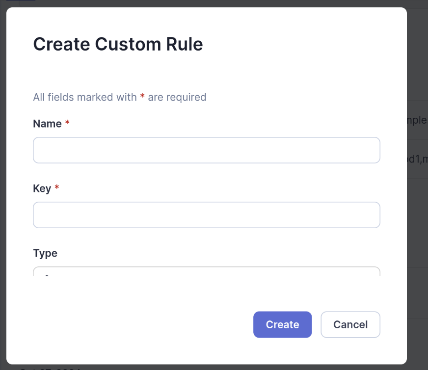

# Custom rules plugin for SonarQube 10.3 and Java 11

## Install

* `cd <project directory>`
* `mvn clean install`
* `cp ./target/sonar-java-custom-rules-0.0.2.jar ./volumes/plugins/`
* `docker compose up`

## Debug

`mvnDebug clean install sonar:sonar -Dsonar.projectKey='<project_key>' -Dsonar.projectName='<project_name>' -Dsonar.host.url=http://localhost:9000 -Dsonar.token=<token>`

## Как пользоваться

* Добавлены два новых template правила - можно найти поиском во вкладке Rules в Sonarqube
    * Disallow methods calls for specified types
        * Параметры:
            * targets - методы, которые нужно запретить
            * exclusions - какие классы и методы исключить из анализа (в которых вызываются методы из targets)
    * Disallow value in string arguments of method calls for specified types
        * Параметры:
            * targets - методы, которые нужно запретить
            * exclusions - какие классы и методы исключить из анализа (в которых вызываются методы из targets)
            * forbiddenString - значение, которое нужно запретить в строковых аргументах методов из targets, например в targets: "org.openqa.selenium.JavascriptExecutor#executeScript" нужно запретить "click"
    * Формат параметров targets и exclusions - строка com.example.Class#method1,method2,method3
    * Формат forbiddenString - строка

### Пример:

* Заходим на страницу template "Disallow methods calls for specified types"

* Нажимаем Create в Custom Rules
* Указываем нужные параметры

* Переходи на страницу нового правила, кликнув на название

* Активируем правило кнопкой Activate
